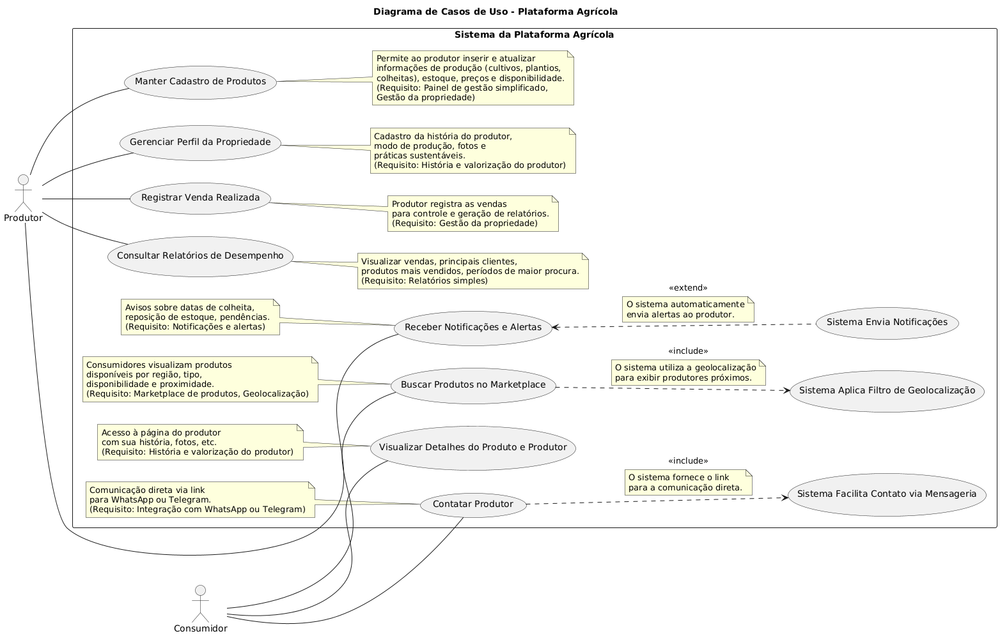
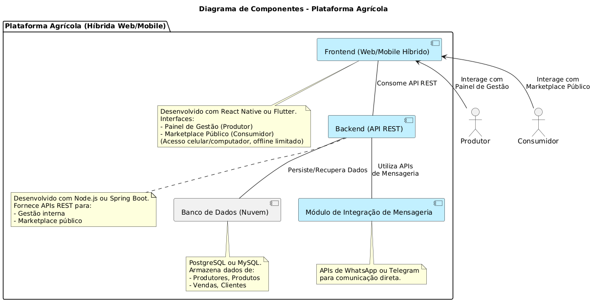
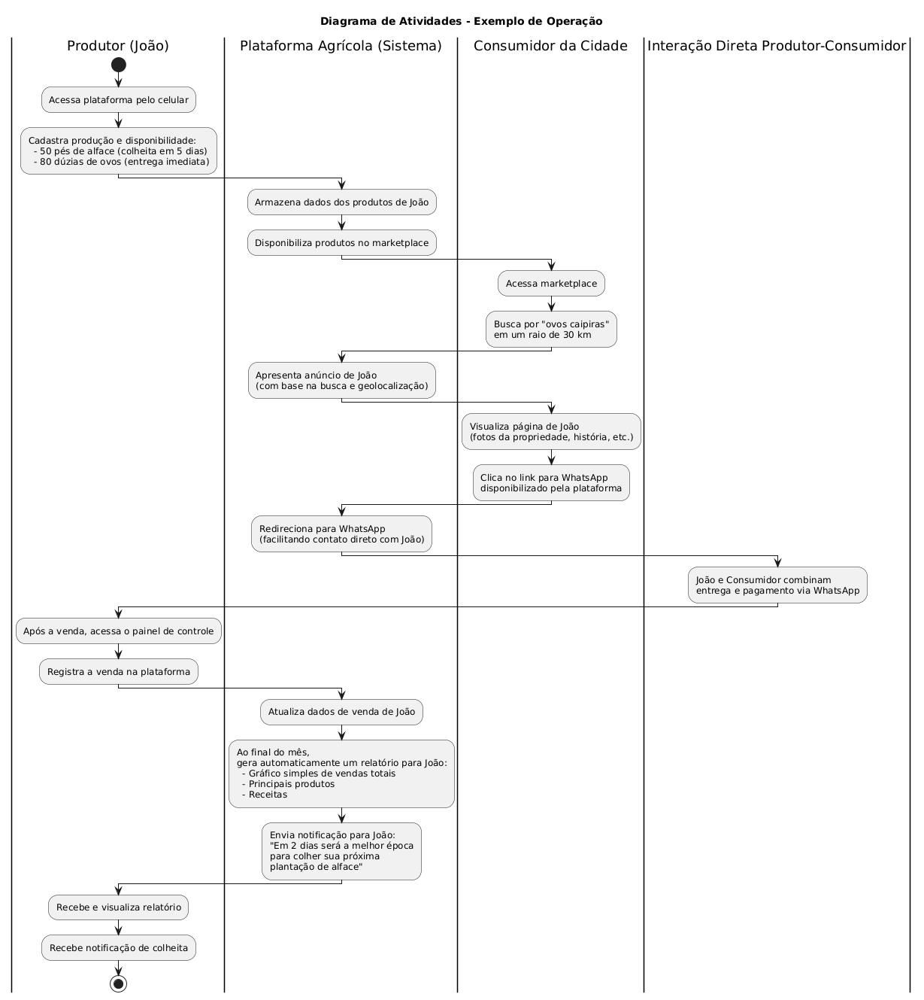

# Colono - Plataforma de Conexão entre Produtores Agrícolas e Consumidores

**Autor:** Carlos Manoel Wendorff
**Instituição:** Católica de Santa Catarina, Jaraguá do Sul
**Curso:** Engenharia de Software – 7ª fase
**Data:** Maio de 2025 (Ajuste conforme a data real)

## Sobre o Projeto

O projeto "Colono" visa desenvolver uma plataforma web/mobile híbrida para facilitar a conexão direta entre pequenos produtores agrícolas e consumidores urbanos. A plataforma permitirá aos produtores gerenciar sua produção, estoque e vendas, além de oferecer um marketplace para que os consumidores encontrem produtos locais frescos, valorizando o trabalho do agricultor e promovendo o consumo consciente.

Este repositório contém o código-fonte, a documentação e os artefatos relacionados ao desenvolvimento do projeto de TCC.

## Documentação Completa do TCC 

Para uma visão detalhada do projeto, incluindo fundamentação teórica, requisitos, modelagem, e decisões de design, acesse o documento completo do TCC no Google Docs:

[>> Link do documento <<](https://docs.google.com/document/d/1m90kXis2elUV4neOVivXr6oxDvKhpsL4VKhYZOJwX3E/edit?usp=sharing)

## Estrutura do Repositório

O repositório está organizado da seguinte forma:

## Diagramas do Sistema

Os seguintes diagramas UML foram criados para modelar e documentar diferentes aspectos do sistema "Colono":

### 1. Diagrama de Casos de Uso

* **Descrição:** Este diagrama ilustra as principais funcionalidades que o sistema "Colono" oferece e como os diferentes usuários (Produtor e Consumidor) interagem com elas. Ele detalha ações como "Manter Cadastro de Produtos", "Buscar Produtos no Marketplace", "Registrar Venda", "Contatar Produtor", entre outras.
* **Objetivo:** Fornecer uma visão clara do escopo funcional do sistema e dos requisitos dos usuários.
* **Localização:** O código PlantUML e uma descrição detalhada podem ser encontrados na conversa anterior ou podem ser gerados e salvos em `/docs/diagrams/DiagramaCasosDeUso.png`.

### 2. Diagrama de Componentes

* **Descrição:** Apresenta a arquitetura de alto nível do sistema "Colono", identificando os principais componentes de software e suas inter-relações. Os componentes incluem o `Frontend (Web/Mobile Híbrido)`, o `Backend (API REST)`, o `Banco de Dados (Nuvem)` e o `Módulo de Integração de Mensageria`.
* **Objetivo:** Mostrar como o sistema é estruturado tecnologicamente, com base nas tecnologias escolhidas (React Native/Flutter, Node.js/Spring Boot, PostgreSQL/MySQL).
* **Localização:** O código PlantUML e uma descrição detalhada podem ser encontrados na conversa anterior ou podem ser gerados e salvos em `/docs/diagrams/DiagramaComponentes.png`.

### 3. Diagrama de Atividades - Exemplo de Operação

* **Descrição:** Ilustra o fluxo de trabalho de um cenário específico de uso da plataforma, conforme descrito na seção "1.4 Exemplo de Operação" do TCC. Ele mostra as etapas sequenciais realizadas pelo Produtor (João), pelo Consumidor e pela própria Plataforma Agrícola (Sistema) em uma interação típica.
* **Objetivo:** Detalhar um processo chave do sistema, facilitando o entendimento de como as diferentes partes interagem para alcançar um resultado específico.
* **Localização:** O código PlantUML e uma descrição detalhada podem ser encontrados na conversa anterior ou podem ser gerados e salvos em `/docs/diagrams/DiagramaAtividades_ExemploOperacao.png`.

## Tecnologias Propostas (Resumo)

* **Plataforma:** Híbrida (Web/Mobile) com React Native ou Flutter.
* **Backend:** API REST com Node.js ou Spring Boot.
* **Banco de Dados:** Relacional em nuvem (PostgreSQL ou MySQL).
* **Comunicação:** Integração com APIs de WhatsApp ou Telegram.

## Como Contribuir ou Executar (Exemplo)